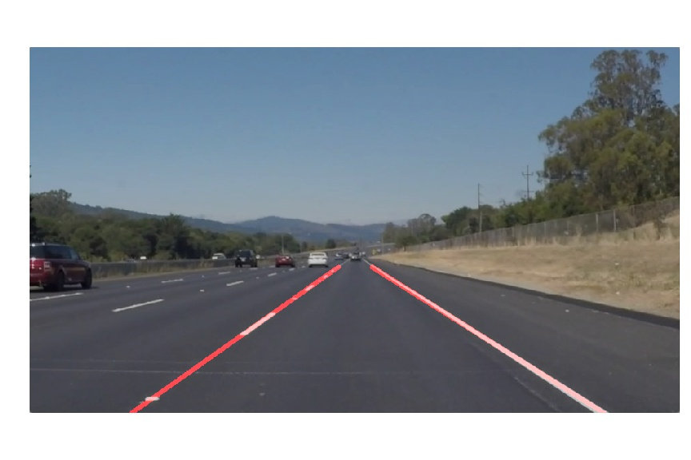
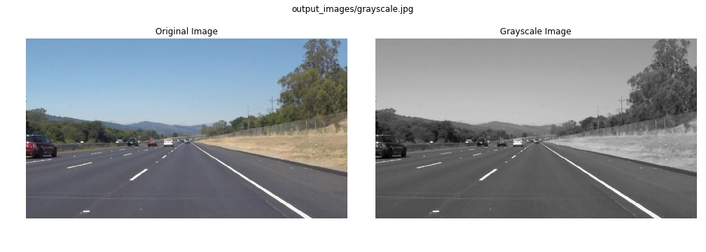
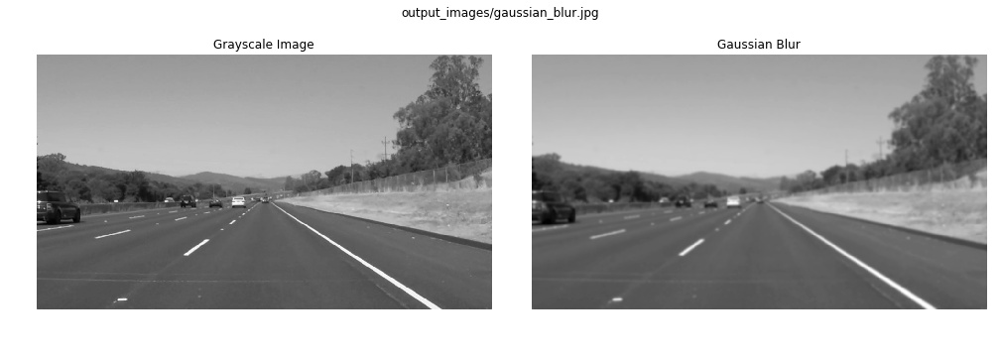
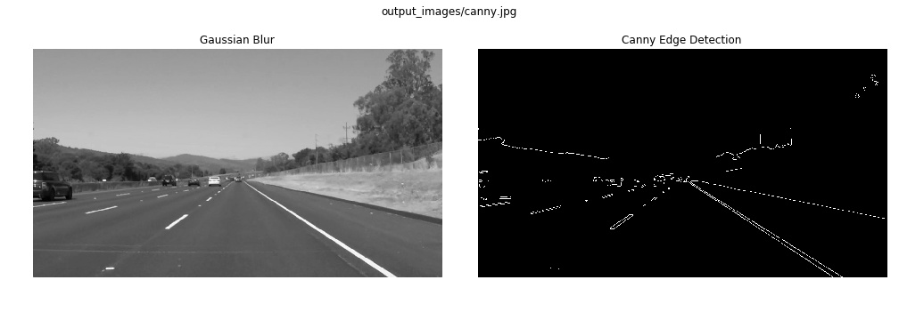
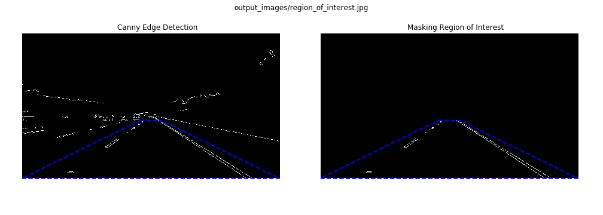
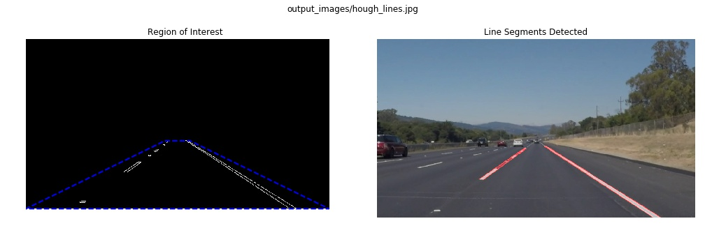
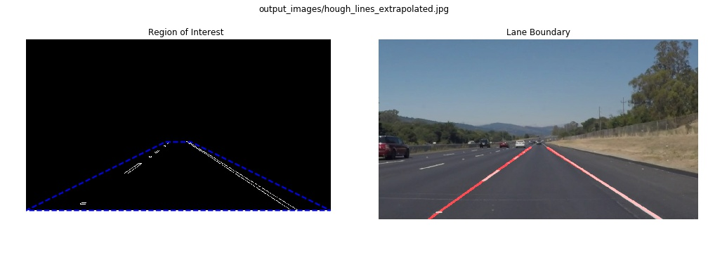

# Finding Lane Lines on the Road
----
*Term 1, Project 1 of Udacity Self-Driving Car Nanodegree, by vuiseng9, August 2017*

> 

This project is about building a pipeline to detect lane of a straight road captured from a front-facing camera on a vehicle. The primary approach for lane detection here are mainly Canny Edge Detection and Hough Transformation. Together with other preprocessing, these techniques are deployed through Python OpenCV API.

> [Complete codes in Jupyter notebook](https://github.com/vuiseng9/SDCND-P001-Finding-Lane-Lines/blob/master/P1_final.ipynb).

> Project output: [White Lane Lines](https://youtu.be/KVirGYAGYOs), [Yellow & White Lane Line](https://youtu.be/szd4s6uW-t8), [Challenge Video](https://youtu.be/_LitMUGX6LU)

---

## Pipeline Descriptions:
1. **Image color transformation to grayscale** 

   The first step of the pipeline is to convert the image to grayscale. This is easily achieved with ```cv2.cvtColor(img, cv2.COLOR_RGB2GRAY)``` in ```grayscale``` function where ```img``` is the input image and second argument is the source-to-destination color space identifier. It is important to note the difference between Matplotlib and OpenCV color space convention Matplotlib uses RGB where OpenCV uses BGR. Hence, second argument should be dependant on the way image is ingested.
   > 

2. **Noise Reduction**

   The second function in the pipeline is defined as ```gaussian_blur``` where its blurring effect is essentially smoothening out the noise in the image. The cv2 API used in this step is ```cv2.GaussianBlur```, which is a 2d convolution processing using Gaussian Kernel. Pls find [good explanation](https://www.youtube.com/watch?v=C_zFhWdM4ic&t=2s) by Dr Mike Pound. Larger kernel size incurs more compute cycles, hence, 3x3 kernel is choosen since the video quality is pretty decent.
   > 

3. **Canny Edge Detection**

   Here comes one of the cores of this project, Canny Edge Detection. It is a series of operations to extract the edges in an image, the operations are 
   * **Intensity Gradient of image using Sobel Operator** - basically also a 2d convolution but using a kernel known as Sobel. Sobel kernel is applied in x & y direction, the result pair is furthur computed as magnitude and angle to serve as metrics if they are edges.
   * **Non-maximum Suppression** - In brief, it is to extract prominent pixels that may constitute edges by scanning magnitude and angle computed previously and getting the local-maximum pixels. This is also why we get thin edges as the output of this function.
   * **Hysteris Thresholding** - An interesting thresholding is applied to extract edges where (1) pixels of value over upper limit are retained, (2) pixels of values lower than lower limit are discarded, (3) pixels of values between the limits are only retained if they are connected to the pixels over the upper threshold limit.
   ```cv2.Canny``` of OpenCV has neatly abstracts the steps above where users only need to specify the hysterisis thresholding limit. For our pipeline, we furthur abstract it as ```canny(img, low_threshold, high_threshold)```
   > 

   Reference: [OpenCV-Python Tutorials](http://opencv-python-tutroals.readthedocs.io/en/latest/py_tutorials/py_imgproc/py_canny/py_canny.html) and [Computerphile - Dr. Mike Pound](https://www.youtube.com/watch?v=sRFM5IEqR2w&t=3s)

4. **Region of Interest**

   Now, edges are detected but we notice that there are more straight edges other than the lane lines. We need to filter away the unwanted edges by masking. We define a function ```region_of_interest```. The function allows inputs of polygon vertices. ```cv2.fillPoly``` of the function fills the polygon with white color, regardless if input image is grayscale or RGB. Finally, application of ```cv2.bitwise_and``` is able to extract the edges within the polygon. As in our scenario, the appropriate polygon is a trapezoid where the other edges such as adjacent lane lines, the asphalt boundary and divider edges can be filtered.

   > 

5. **Hough Line Transform**

   Now, we can see the lane boundary of our interest in segments. If we are going to draw the boundary line, we simply need to form a mathematical equation of the straight line that passes through all segments. This is when Hough Transform comes in.

   Hough transform represents a dot in cartesian as a sinusoid in Hough Space. It means that each of the edge pixels in the region of interest forms its sinusoid respectively. The interesting quality in Hough Space is that the sinusoids which represents each pixel in a straight line will be intersecting each other in a vicinitiy. With that quality, the algorithm divides the Hough Space into grids and counts the number of intersections in each grid. A line is determined when a grid exceeds a specified threshold. The detected grid is easily converted back to Cartesian to form the corresponding equation. 

   To put this in the perspective of ```hough_lines(img, rho, theta, threshold, min_line_len, max_line_gap```, the ```rho``` and ```theta``` are the Hough Space parameters and they are the input to specify the resolution of the grids. ```threshold``` is the minimum intersection required in a grid to be considered as a line. The ```max_line_gap``` is for connecting line segments where the segments are within this gap will be connected. On the hand, the ```min_line_len``` discards that line that is shorter than this argument. The function finally returns a list of lines with thier start and end coordinates.

   > 

6. **Mark Lane Boundary**

   The final step is to draw the lane boundary. ```draw_lines``` takes in the list of line segments. There are two visualization features, i.e. drawing the line segments as they are and drawing the lane boundary, they can be toggled through ```extrapolate```. So how do we extrapolate? Well, it is simple by just calculating the start and endpoint through the line equation. However, sooner or later, few problems show up. First, there are false lines crossing in some video frames. The second problem is that there are too many noisy lines around the lane boundary, imagine all segments are being extrapolated. To overcome the first problem, a simple logic is integrated, we only want lines having gradient of interest. Fake lines can be filtered in this way. To solve the many noisy lines, we average them out so that only a single line is plotted for left and right lane boundary.

   > 

   ```python
   def draw_lines(img, lines, color=[255, 0, 0], thickness=2, extrapolate=True):

       line_img = np.zeros((img.shape[0], img.shape[1], 3), dtype=np.uint8)
       
       # Entering this loop to extrapolate line segments
       if extrapolate:
           lm = []; lb = []
           rm = []; rb = []
           
           for line in lines:
               for x1,y1,x2,y2 in line:
                   m = (y2-y1)/(x2-x1) # Compute line gradient
                   
                   # Ignore line if
                   # * gradient is infinite
                   # * gradient is not within range of interest
                   if (np.isfinite(m)) & (abs(m) < 1) & (abs(m) > 0.5):
                       b = y1 - m*x1 # compute intersept
                       
                       # Determine left/right line segments by gradient
                       # & Store them to list
                       if m < 0:
                           lm.append(m); lb.append(b)
                       else:
                           rm.append(m); rb.append(b)
           
           # Averaging coefficient of left and right line segments
           # Followed by extrapolation calculation
           if len(lm) > 0:
               _m = sum(lm)/len(lm)
               _b = sum(lb)/len(lb)
               l_p0 = (int((img.shape[0]-_b)/_m), img.shape[0])
               l_p1 = (int((img.shape[0]/2*1.2-_b)/_m), int(img.shape[0]/2*1.2))
               cv2.line(line_img, l_p0, l_p1, color, thickness)
           if len(rm) > 0:
               _m = sum(rm)/len(rm)
               _b = sum(rb)/len(rb)
               r_p0 = (int((img.shape[0]-_b)/_m), img.shape[0])
               r_p1 = (int((img.shape[0]/2*1.2-_b)/_m), int(img.shape[0]/2*1.2))
               cv2.line(line_img, r_p0, r_p1, color, thickness)
       
       # Hough-detected segments are drawn as they are
       else:
           for line in lines:
               for x1,y1,x2,y2 in line:
                   cv2.line(line_img, (x1, y1), (x2, y2), color, thickness)
       
       # Image Blending Parameters
       α=0.8; β=1.; λ=0.
       
       # Overlay the drawn line image on input image
       return cv2.addWeighted(img, α, line_img, β, λ)
   ```

----

### Results & Reflection

The 3 test videos of the project are fed through the pipeline using the MoviePy's clip transformation handler ```VideoFileClip.fl_image```. Output can find at links:

[White Lane Lines](https://youtu.be/KVirGYAGYOs), [Yellow & White Lane Line](https://youtu.be/szd4s6uW-t8), [Challenge Video](https://youtu.be/_LitMUGX6LU)

Overall, the line detection is decent for the 3 project videos where lane boundary is detected most of the time other than no detection occasionally in tough frames.

**Potential Shortcomings**
1. Pipeline may not be tuned to generalize vast lighting conditions that affects the visibility towards lane.
2. Insufficient when lane is curving (challenge video) when vehicle is traversing straight lane of varying elevation.
3. The assumption of region of interest masking and filtering region of gradient is very restrictive when we need to consider multiple lanes and detection of other objects. Perhaps multiple pipelines for different purpose.

**Possible improvements**
1. Stateful implementation where there are robustness design dependant on historical detection to overcome light conditions. This can also solve the jittering of the line through averaging historical line parameters.
2. Detection of lane is essential for vehicle to know drivable area, region of interest can be widened to detect adjacent lane.
3. There is no infinite straight road in the world, we need to detect curves!
4. What if there is no line marking? we need to cater for this too.

